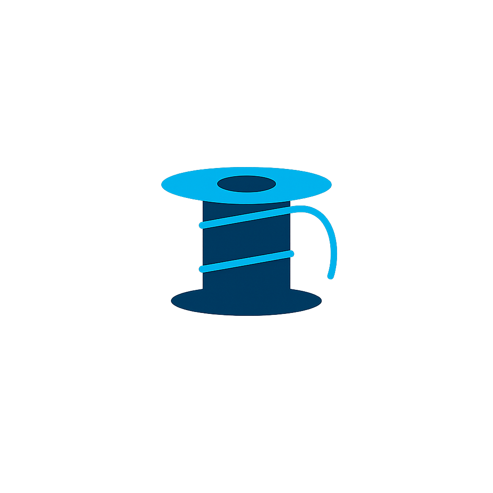
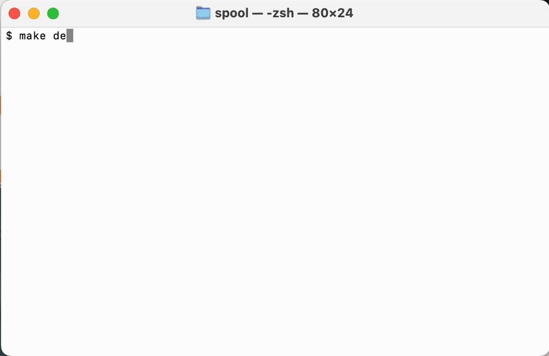
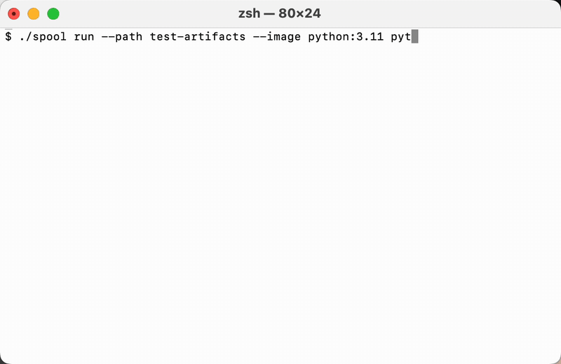
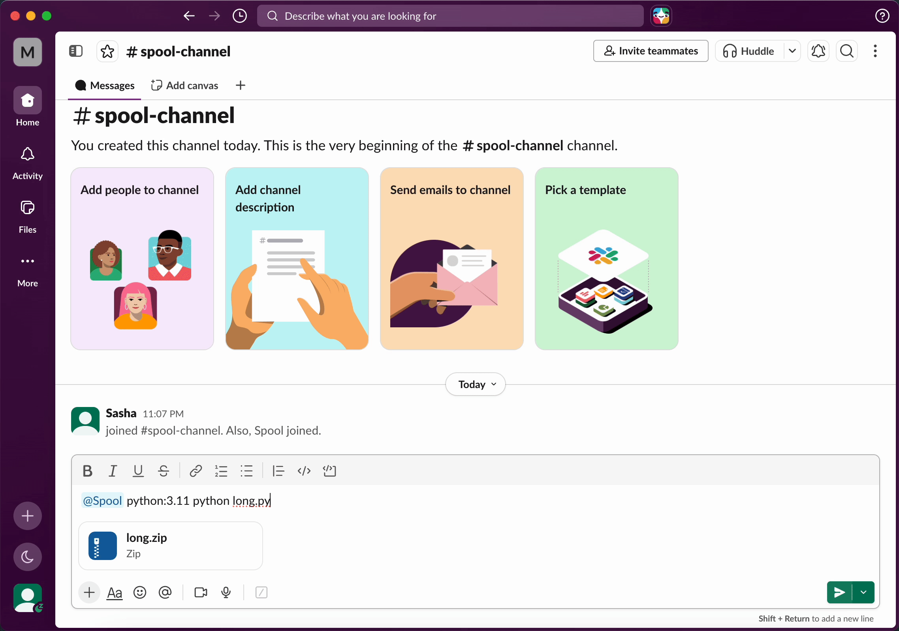

<p align="center">
  
</p>

<h1 align="center">Spool</h1>

<p align="center">Run Docker jobs from a CLI or a Slack channel.</p>

<p align="center">
  <a href="https://go.dev"></a>
  <a href="LICENSE"></a>
  
  
</p>

<hr>

## Install

Requires [Go 1.26+](https://go.dev/dl/), [Docker](https://docs.docker.com/get-docker/) and a running Redis (included via compose):

```bash
git clone https://github.com/parrahex/spool.git
cd spool
go build ./...
```

## Quick Start

Start Redis, the worker pool and the Slack bot in one command:

```bash
export SLACK_APP_TOKEN=xapp-...
export SLACK_BOT_TOKEN=xoxb-...
make dev
```



### From the CLI

```bash
go run ./cmd/cli run --image alpine echo hello world
go run ./cmd/cli status 63572007-a8ce-4657-9e5c-0455dfdac509
go run ./cmd/cli cancel 63572007-a8ce-4657-9e5c-0455dfdac509
```



### From Slack

Mention the bot in any channel or DM it. Attach files to run them:

```
@Spool alpine echo hello world
```

```
@Spool python:3.11 python script.py
[script.py attached]
```

```
@Spool golang:1.26 go run main.go
[project.zip attached]
```

The bot replies in a thread with the job id, then posts the exit code and output when the job finishes.



## Features

- **Parallel workers** — a pool of goroutines drains the queue; scale with one env var
- **Crash recovery** — jobs are leased; a dead worker's jobs requeue automatically on the next startup
- **Timeouts & retries** — per-job execution limits, configurable retry attempts
- **Zombie cleanup** — every container is labeled and killed if its worker disappears
- **File attachments** — zips, folders, single files; all extracted and mounted read-only at `/app`
- **Graceful shutdown** — in-flight containers get a context cancel, not a kill

## Configuration

| Variable             | Default           | Description                    |
| -------------------- | ----------------- | ------------------------------ |
| `REDIS_ADDR`         | `localhost:6379`  | Redis address                  |
| `SPOOL_CONCURRENCY`  | `1`               | Number of parallel workers     |
| `SLACK_APP_TOKEN`    | —                 | App-level token for Socket Mode |
| `SLACK_BOT_TOKEN`    | —                 | Bot user OAuth token           |

## Slack app setup

Create the app from [slack-app-manifest.yml](slack-app-manifest.yml) at [api.slack.com/apps](https://api.slack.com/apps) → *Create New App* → *From a manifest*. Then install it to your workspace and copy the two tokens.

## License

[MIT](LICENSE)
